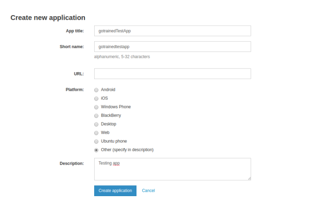
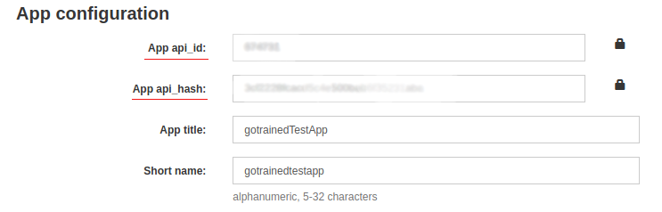

# Description:
A script for parsing group members in Telegram and save list saves the list to a cvs file. If group members are public.
To gather an audience by interest.
___
#### NOTE:
Before using script, you need have Telegram account and be in the group from which you want to get users.

```
https://my.telegram.org/
```

In this site you must get Api_id and Api_Hash. and write in file .env (you can edit .env_sample, and rename to .env)
1. Create new application (any name)

2. Get Api_id and Api_Hash

___
# Installation
___
1. Python 3.x must be installed.
2. Copy project
```
git clone https://github.com/bezhevets/scraper_members_group_telegram.git
```
3. Create and activate your virtual environment and install requirements:
```
python -m venv venv
venv\Scripts\activate (on Windows)
source venv/bin/activate (on macOS)
pip install -r requirements.txt
```
4. Edit .env_sample file and rename .env
5. Run script
```
python main.py
```
___
# Usage
First connection need authorization in terminal
```
Please enter your phone (or bot token): <your acc phone>
Please enter the code you received: <code in massege>
```
Then follow the instructions in the terminal. 
When the code is complete, the list of users will be in a file in the project folder with the name of the group.